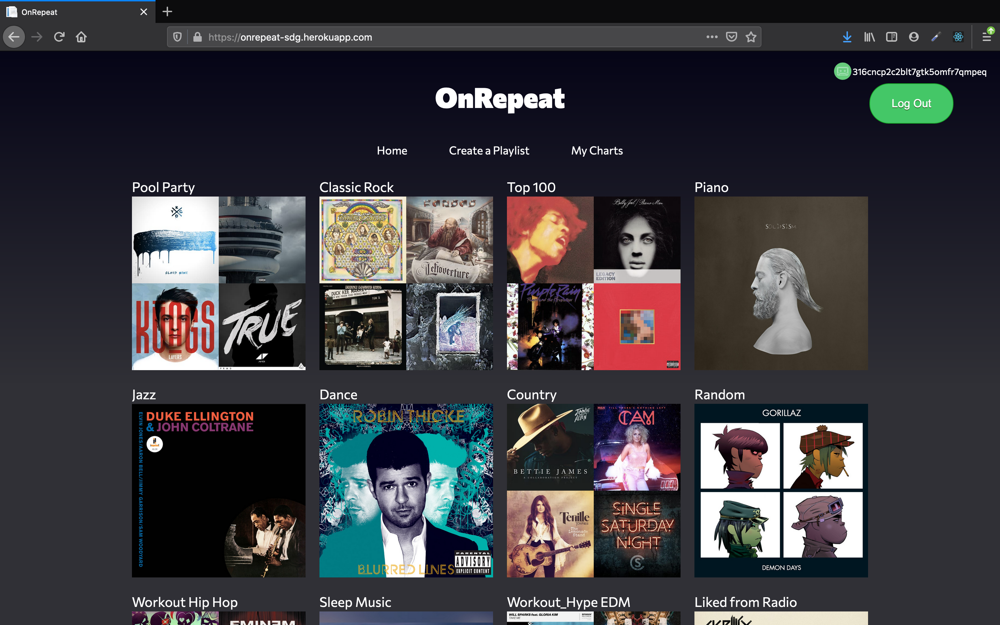
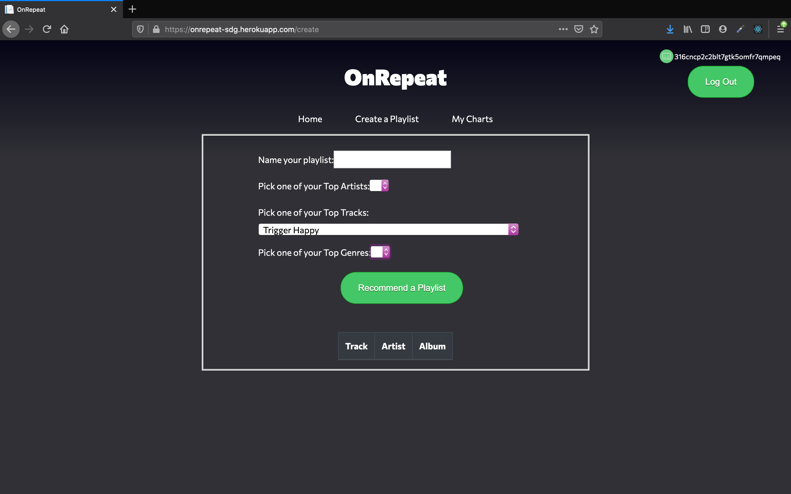
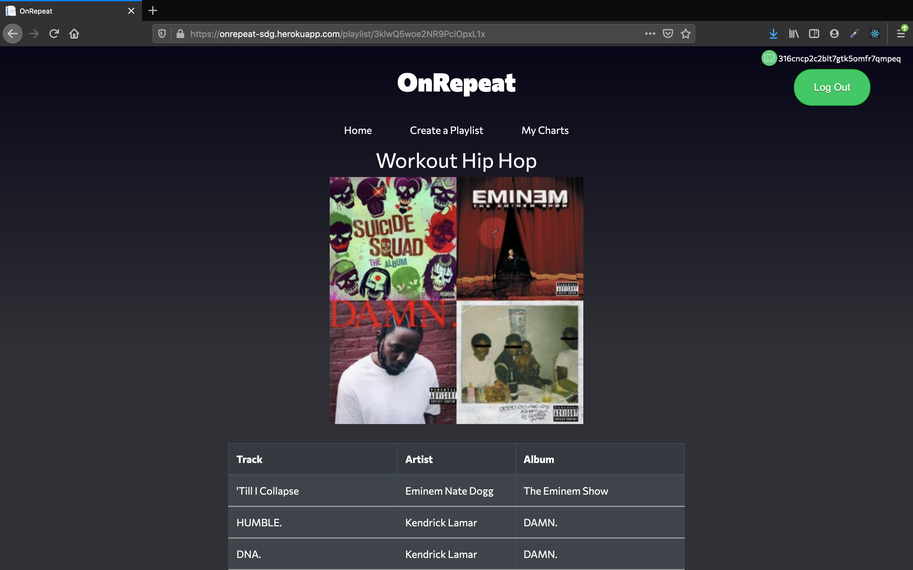
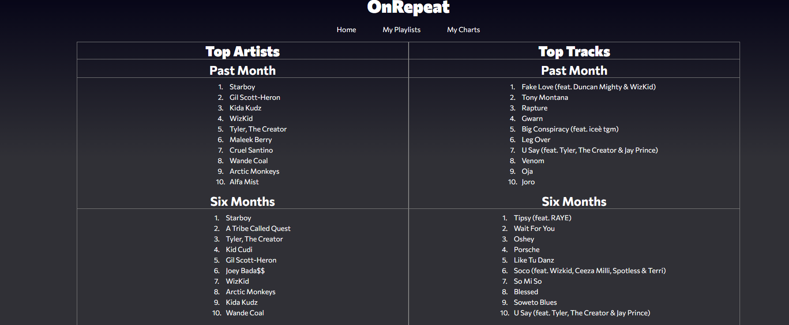

# OnRepeat

- The main objective is to allow users to sign in with their own Spotify music account and create a custom playlist based off of their user data along with some other smaller features.
- Upon entering the site the user will click our login button which will redirect them to login to their Spotify account using their Facebook, Google Account, or email that they normally would use to sign into Spotify. Once signed in they will be redirected back to our Home page.
- The navigation bar at the top of the screen redirects the user to the Home page, Create Playlist page, or My Charts page.
- The Home page displays all of the user's current playlists they have on Spotify with the Title and Album artwork. The user can also click on any of the individual Playlists and it will show them the Track, Artist, and Album for each song in their playlist.
- The Create a Playlist page allows the user fill out a form that asks them to name the playlist, select an artist, a track, and a genre and from there a New Playlist will be created based off of those parameters and the user's preferences determined by Spotify. The user can then return to their Spotify page and the New Playlist will appear and be ready to listen to.
- The My Charts page displays some interesting information about the user's music history on Spotify. It show's the User a top 10 list of their most listened to Artists and Tracks over the last month, 6 months, and All Time history using Spotify.
- The overall goal is to create unique playlists for users that are specific to their user history on Spotify paired with the ability for the user to narrow down that information with the end result being a one of a kind playlist for any occasion.

